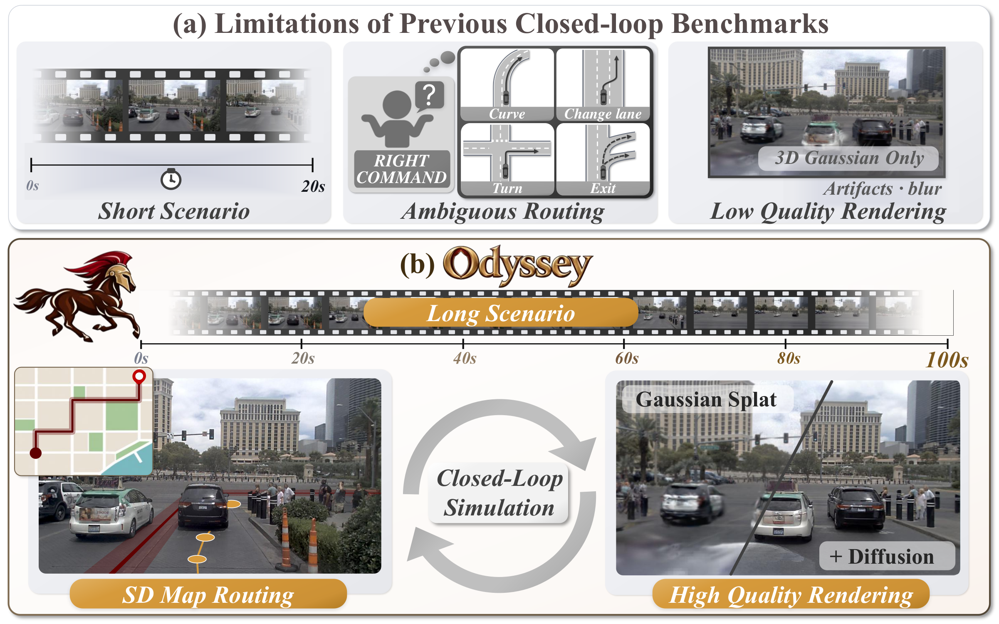

# Odyssey

### A Closed-Loop Benchmark for Long-Horizon Real-World Driving with Explicit Navigation Routes

[Jungho Kim](https://kimjh7669.github.io/)\*,
[Hongjae Shin](https://scholar.google.com/citations?user=4zQMBBAAAAAJ&hl=ko&oi=ao)\*,
[Seunghoon Yu](https://scholar.google.com/citations?user=RJnWLIUAAAAJ&hl=en)\*,
[Heecheol Yoo](https://scholar.google.com/citations?user=bwJ1KkcAAAAJ&hl=ko&oi=ao)\*,
[Myeongjun Kim](https://scholar.google.com/citations?hl=ko&user=-AT4lfIAAAAJ)\*,
[Jiyong Oh](https://scholar.google.com/citations?hl=ko&user=C10ysNMAAAAJ)\*
 
Donghyuk Kwak,
Seunghyeop Nam,
Haesung Oh,
Hyunju Kim,
Hyungchan Cho,
Jaehyun Park,
 
[Soo Won Seo](https://scholar.google.com/citations?user=1J-usWkAAAAJ&hl=en),
[Jun Won Choi](https://scholar.google.com/citations?user=IHH2PyYAAAAJ&hl=en)†

**Seoul National University, South Korea**

\* Equal contribution &nbsp;&nbsp; † Corresponding author

  

## Overview

**Odyssey** is a closed-loop driving benchmark with **SD-map route guidance**, **long 100-second scenarios**, and **high-quality 3DGS + diffusion rendering**.

| Rendering | Routing | Source Log | Scenarios |
| :---: | :---: | :---: | :---: |
| **3DGS + Diff.** | **SD** | **100 s** | **100** |
| Enhanced visual quality at novel viewpoints | Explicit, unambiguous road-level routes | Reconstructed from continuous 100-second nuPlan logs | Multiple turns, lane changes followed by turns, traffic lights, pedestrians, ... |
