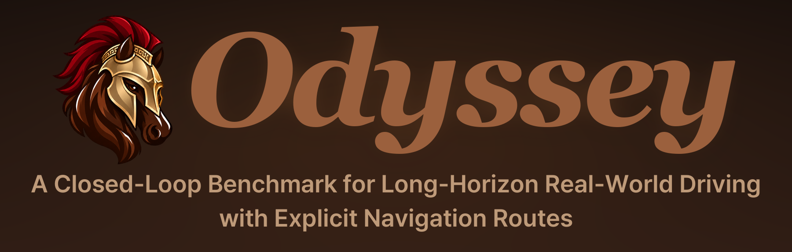
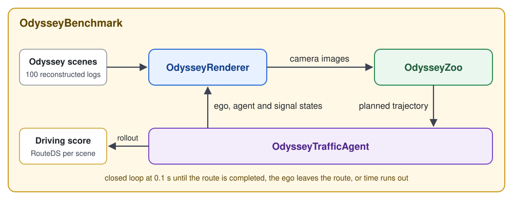

<div align="center">



[Jungho Kim](https://kimjh7669.github.io/)<sup>\*</sup>,
[Hongjae Shin](https://scholar.google.com/citations?user=4zQMBBAAAAAJ&hl=ko&oi=ao)<sup>\*</sup>,
[Seunghoon Yu](https://scholar.google.com/citations?user=RJnWLIUAAAAJ&hl=en)<sup>\*</sup>,
[Heecheol Yoo](https://scholar.google.com/citations?user=bwJ1KkcAAAAJ&hl=ko&oi=ao)<sup>\*</sup>,
[Myeongjun Kim](https://scholar.google.com/citations?hl=ko&user=-AT4lfIAAAAJ)<sup>\*</sup>,
[Jiyong Oh](https://scholar.google.com/citations?hl=ko&user=C10ysNMAAAAJ)<sup>\*</sup>
<br>
Donghyuk Kwak,
Seunghyeop Nam,
Haesung Oh,
Hyunju Kim,
Hyungchan Cho,
Jaehyun Park,
<br>
[Soo Won Seo](https://scholar.google.com/citations?user=1J-usWkAAAAJ&hl=en),
[Jun Won Choi](https://scholar.google.com/citations?user=IHH2PyYAAAAJ&hl=en)<sup>†</sup>

**Seoul National University, South Korea**

<sup>\*</sup> Equal contribution &nbsp;&nbsp; <sup>†</sup> Corresponding author

[](https://snu-adr.github.io/Odyssey-Page/)
[](https://arxiv.org/abs/2610.06469)
[](https://huggingface.co/datasets/ADRLAB/odyssey-scenes)

</div>

<p align="center">
  
</p>

## Overview

**Odyssey** is a closed-loop driving benchmark with **SD-map route guidance**, **long 100-second scenarios**, and **high-quality 3DGS + diffusion rendering**.

| Rendering | Routing | Source Log | Scenarios |
| :---: | :---: | :---: | :---: |
| **3DGS + Diff.** | **SD** | **100 s** | **100** |
| Enhanced visual quality at novel viewpoints | Explicit, unambiguous road-level routes | Reconstructed from continuous 100-second nuPlan logs; an episode runs up to 200 s | Multiple turns, lane changes followed by turns, traffic lights, pedestrians, ... |

## Benchmark

Odyssey runs each planner closed loop in 100 reconstructed nuPlan scenes. Each scene is run in two traffic
modes: **non-reactive**, where other vehicles replay the log, and **reactive**, where other vehicles follow IDM.
A sheet reports the mean over the 100 scenes for one model and one traffic mode. The metric definitions are in
[docs/benchmark.md](docs/benchmark.md).

### Results

The table compares planners with (✓) and without (×) SD-route guidance. RouteDS is the main score. SDC is
SD-route compliance, PLCA and PLCS are pre-lane-change accuracy and score, Eff. is efficiency and Comf. is
comfort.

<table>
  <thead>
    <tr><th rowspan="2">Method</th><th rowspan="2">SD route</th><th colspan="6">Non-reactive</th><th colspan="6">Reactive</th></tr>
    <tr><th>RouteDS</th><th>SDC</th><th>PLCA</th><th>PLCS</th><th>Eff.</th><th>Comf.</th><th>RouteDS</th><th>SDC</th><th>PLCA</th><th>PLCS</th><th>Eff.</th><th>Comf.</th></tr>
  </thead>
  <tbody>
    <tr><td rowspan="2">LTF</td><td>×</td><td>16.2</td><td>51</td><td>66.0</td><td>50.3</td><td>63.9</td><td>100</td><td>16.3</td><td>54</td><td>63.5</td><td>49.1</td><td>76.1</td><td>99</td></tr>
    <tr><td>✓</td><td>20.1</td><td>95</td><td>57.1</td><td>56.1</td><td>68.2</td><td>96</td><td>23.0</td><td>93</td><td>53.6</td><td>52.6</td><td>78.0</td><td>93</td></tr>
    <tr><td rowspan="2">DiffusionDrive</td><td>×</td><td>25.6</td><td>59</td><td>78.8</td><td>63.7</td><td>61.4</td><td>100</td><td>24.2</td><td>59</td><td>77.0</td><td>63.1</td><td>75.7</td><td>100</td></tr>
    <tr><td>✓</td><td>35.9</td><td>100</td><td>82.0</td><td>80.5</td><td>63.4</td><td>99</td><td>41.0</td><td>100</td><td>81.2</td><td>80.2</td><td>71.5</td><td>99</td></tr>
    <tr><td rowspan="2">DrivoR</td><td>×</td><td>20.6</td><td>50</td><td>75.5</td><td>62.8</td><td>104.7</td><td>44</td><td>25.5</td><td>53</td><td>76.6</td><td>62.8</td><td>133.4</td><td>47</td></tr>
    <tr><td>✓</td><td>36.5</td><td>90</td><td>72.8</td><td>66.0</td><td>84.5</td><td>60</td><td>41.4</td><td>89</td><td>71.8</td><td>66.0</td><td>107.4</td><td>64</td></tr>
    <tr><td rowspan="2">SafeDrive</td><td>×</td><td>27.5</td><td>41</td><td>79.3</td><td>63.7</td><td>69.4</td><td>47</td><td>30.4</td><td>45</td><td>78.8</td><td>62.8</td><td>86.3</td><td>40</td></tr>
    <tr><td>✓</td><td>44.4</td><td>82</td><td>75.0</td><td>69.8</td><td>68.3</td><td>44</td><td>48.9</td><td>79</td><td>73.8</td><td>69.5</td><td>81.3</td><td>49</td></tr>
    <tr><td rowspan="2">ReCogDrive (VLA)</td><td>×</td><td>15.4</td><td>71</td><td>75.7</td><td>59.0</td><td>76.9</td><td>100</td><td>20.3</td><td>62</td><td>77.1</td><td>58.7</td><td>93.7</td><td>99</td></tr>
    <tr><td>✓</td><td>21.5</td><td>83</td><td>74.4</td><td>55.8</td><td>59.3</td><td>98</td><td>26.3</td><td>84</td><td>75.6</td><td>56.7</td><td>75.5</td><td>98</td></tr>
  </tbody>
</table>

The configs for these runs are under `OdysseyBenchmark/agents/`, named `<model>_baseline.yaml` (×) and
`<model>_sdroute.yaml` (✓). The checkpoints are in [ADRLAB/odyssey-models](https://huggingface.co/ADRLAB/odyssey-models).
All results were obtained on NVIDIA B200 GPUs with the Fixer restorer running as TensorRT bf16 engines.

## Structure

<p align="center">
  
</p>

| Component | What it holds |
|---|---|
| [OdysseyRenderer](OdysseyRenderer/) | Gaussian rendering of the reconstructed scene (background, vehicles, pedestrians, traffic lights) and the Fixer image restorer |
| [OdysseyZoo](OdysseyZoo/) | the baseline planners in their native code, and the SD-route builder |
| [OdysseyTrafficAgent](OdysseyTrafficAgent/) | the simulated world: ego controller, log-replay and IDM traffic, signal timetables, episode termination, trajectory recording |
| [OdysseyBenchmark](OdysseyBenchmark/) | the evaluation: launcher and job queue, agent configs, scoring, results sheet |

## Getting Started

Install first ([docs/installation.md](docs/installation.md)), then:

```bash
python OdysseyBenchmark/tools/check_env.py --agent OdysseyBenchmark/agents/ltf_sdroute.yaml                         # 0. host, assets, interpreters
python -m odyssey_runtime check --agent OdysseyBenchmark/agents/ltf_sdroute.yaml                                  # 1. config, model build, one synthetic step (--device cpu: no GPU)
AGENT_CONFIG=OdysseyBenchmark/agents/ltf_sdroute.yaml GPUS=0       bash OdysseyBenchmark/scripts/run_evaluation_debug.sh   # 2. three scenes, short
AGENT_CONFIG=OdysseyBenchmark/agents/ltf_sdroute.yaml GPUS=0,1,2,3 bash OdysseyBenchmark/scripts/run_evaluation_mini.sh    # 3. mini set: 30 scenes x {nr, r}
AGENT_CONFIG=OdysseyBenchmark/agents/ltf_sdroute.yaml GPUS=0,1,2,3 bash OdysseyBenchmark/scripts/run_evaluation_multi.sh   # 4. the benchmark: 100 scenes x {nr, r}
python OdysseyBenchmark/tools/merge_results.py -f experiments/simulation/eval_ltf_sdroute                        # 5. the sheet
```

The commands run the shipped LTF (SD route) config. To evaluate your own model, replace
`OdysseyBenchmark/agents/ltf_sdroute.yaml` with its agent config; its results then go to
`experiments/simulation/eval_<model.name>`.

The step-by-step guide, including how to port your own model, is [docs/getting_started.md](docs/getting_started.md).

| Guide | Covers |
|---|---|
| [docs/installation.md](docs/installation.md) | interpreters, weights, scenes, Fixer, nuPlan maps, environment check |
| [docs/getting_started.md](docs/getting_started.md) | porting a model, debug run, mini set, the full benchmark, results |
| [docs/benchmark.md](docs/benchmark.md) | scene set, planner inputs, metrics, failure policy |
| [docs/results-format.md](docs/results-format.md) | every file the runner and the merger write |
| [docs/deployment.md](docs/deployment.md) | the reference host: versions, container, shell variables |

## Citation

The paper is on arXiv: [arXiv:2610.06469](https://arxiv.org/abs/2610.06469). The BibTeX entry will be added here.

## License

- The code is Apache-2.0 ([LICENSE](LICENSE)). Parts adapted from other projects, and separately
  installed components, keep their own licences; see
  [THIRD_PARTY_NOTICES.md](THIRD_PARTY_NOTICES.md).
- Model weights are distributed separately under these licences:
  - CC BY-NC-SA 4.0 for the checkpoints we trained;
  - Apache-2.0 for redistributed upstream files;
  - the NVIDIA Open Model License for the Fixer weights.
- The scenes and the traffic-light and route data are derived from nuPlan, so the
  [nuPlan terms of use](https://www.nuscenes.org/terms-of-use) apply.

## Acknowledgements

Odyssey builds on:
- [WorldEngine](https://github.com/OpenDriveLab/WorldEngine)
- [nuPlan](https://www.nuscenes.org/nuplan) and [nuplan-devkit](https://github.com/motional/nuplan-devkit)
- [NAVSIM](https://github.com/autonomousvision/navsim)
- [MetaDrive](https://github.com/metadriverse/metadrive)
- [tuPlan Garage](https://github.com/autonomousvision/tuplan_garage)
- [MTGS](https://github.com/OpenDriveLab/MTGS)
- [drivestudio](https://github.com/ziyc/drivestudio)
- [gsplat](https://github.com/nerfstudio-project/gsplat)
- [nvdiffrast](https://github.com/NVlabs/nvdiffrast)
- [NVIDIA Fixer](https://github.com/nv-tlabs/Fixer) and [Cosmos-Predict2](https://github.com/nvidia-cosmos/cosmos-predict2)

The baselines in OdysseyZoo come from:
- [NAVSIM (LTF)](https://github.com/autonomousvision/navsim)
- [DrivoR](https://github.com/valeoai/DrivoR)
- [DiffusionDrive](https://github.com/hustvl/DiffusionDrive)
- [SafeDrive](https://github.com/SPA-junghokim/SafeDrive)
- [ReCogDrive](https://github.com/xiaomi-research/recogdrive)

Route graphs use [OpenStreetMap](https://www.openstreetmap.org/copyright) data (ODbL).
